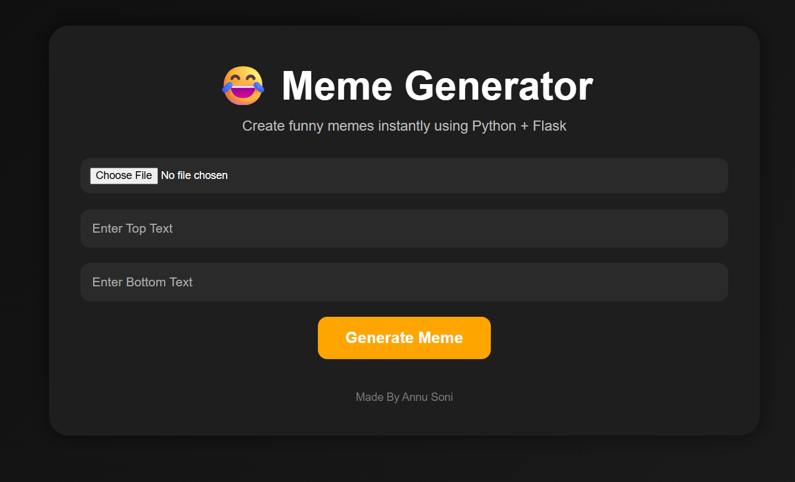

# 😂 Meme Generator

A fun and interactive Meme Generator web app built using Python, Flask, and Pillow.

Users can:
- Upload any image
- Add top and bottom meme text
- Generate memes instantly
- Download generated memes

---

# 🚀 Live Demo

https://meme-generator-wepg.onrender.com/

---

# 📸 Features

✅ Upload Images  
✅ Add Top & Bottom Text  
✅ Auto Centered Meme Text  
✅ Dynamic Font Sizing  
✅ Black Outline Meme Style  
✅ Download Meme Button  
✅ Responsive Dark UI  
✅ Auto Cleanup of Old Files  
✅ Fully Deployed on Render  

---

# 🛠️ Tech Stack

- Python
- Flask
- Pillow (PIL)
- HTML
- CSS
- Gunicorn
- Render

---

# 📂 Project Structure

```bash
Meme_Generator/
│
├── static/
│   ├── generated/
│   └── uploads/
│
├── templates/
│   └── index.html
│
├── app.py
├── requirements.txt
├── .gitignore
└── README.md
```

---

# ⚙️ Installation

## 1️⃣ Clone Repository

```bash
git clone https://github.com/Annu9111/Meme-Generator.git
```

---

## 2️⃣ Move Into Project Folder

```bash
cd Meme-Generator
```

---

## 3️⃣ Create Virtual Environment

### Windows

```bash
python -m venv venv
venv\Scripts\activate
```

### Mac/Linux

```bash
python3 -m venv venv
source venv/bin/activate
```

---

## 4️⃣ Install Dependencies

```bash
pip install -r requirements.txt
```

---

# ▶️ Run Locally

```bash
flask run
```

Then open:

```bash
http://127.0.0.1:5000
```

---

# 🌐 Deployment

This project is deployed on:

- Render
- Gunicorn Production Server

---

# 📦 Requirements

Main libraries used:

```txt
Flask
Pillow
Gunicorn
```

---

# 🧠 How It Works

1. User uploads image
2. Flask receives image
3. Pillow processes image
4. Meme text added dynamically
5. Generated meme displayed
6. User downloads meme

---

# 🔥 Future Improvements

- Meme Templates
- AI Meme Captions
- Text Color Picker
- Font Selection
- Drag & Drop Text
- Cloud Storage
- User Authentication

---

# 📸 Screenshots



---

# 👨‍💻 Author

Made with ❤️ by Annu Soni

GitHub:
https://github.com/Annu9111

---

# ⭐ Support

If you like this project:

⭐ Star the repository  
🍴 Fork the project  
🧠 Share ideas and improvements  

---

# 📄 License

This project is open-source and available under the MIT License.
